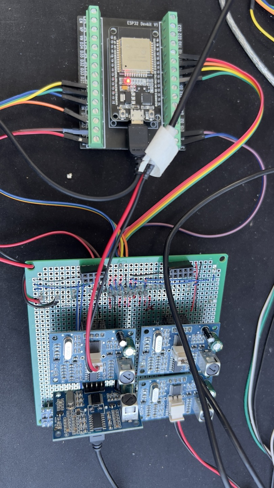

# ESPIDF 기반의 초음파거리센서 다중 제어(4)

ESP-IDF v5.1.4 사용

1 core 80MHz에서 H/W UART와 S/W UART를 이용해서 JSN SR04T-V3.0의 M2 모드로 거리를 측정한 데이터를 USB 인터페이스로 전달합니다.(로그)

https://github.com/junhuanchen/esp-idf-software-serial 를 참고하였습니다.
esp-idf-software-serial의 경우 반복 사용 시(해제 후 다시 연결 시) 경고가 발생해서 Delete 시에 isr제거하는 코드를 추가했습니다.
만약 소프트웨어 시리얼을 다중으로 사용하고자 한다면, isr를 다중으로 사용할 수 있도록 수정해야 합니다.
140ms마다 4개의 초음파거리센서를 측정할 수 있어서 포기했습니다.

JSN SR04T-V3.0을 직접트리거를 주고 시간을 측정하는 방법은 다중으로 사용할 때 문제가 발생해서 uart 방식으로 처리하였으며, 트리거 방식을 한 이유는 타이밍 제어가 필요하다는 생각에서 트리거 신호를 주고 데이터를 수신하는 방법으로 처리하였습니다.

JSN SR04T-V3.0엔 5V(3.3V로 동작을 하는 것을 확인했는데 거리가 이상해지는 보드가 많이 나와서 5V로 변경하였습니다. 5V를 사용해도 거리가 이상해 지는 경우가 확인되어서 QC 문제라고 생각됩니다.)
로직 레벨컨터버터를 이용했습니다.